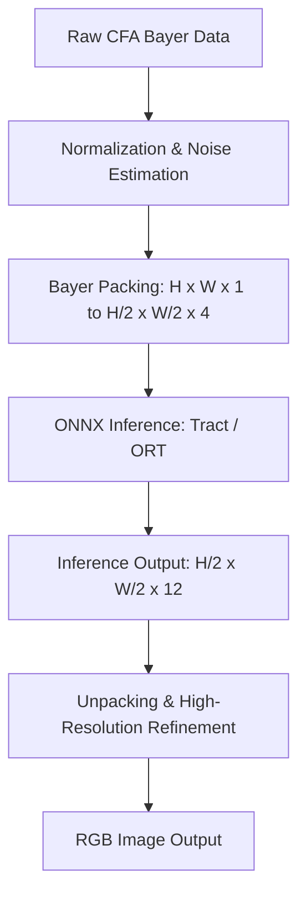

# On-Device AI Joint Demosaicking and Denoising (JDD) in Rust
## A Research Report for `pichromatic`

This document details the research, architecture, and implementation strategy for building an offline, on-device, neural-network-powered joint demosaicking and denoising (JDD) engine in Rust, comparable in principle to **Adobe Lightroom Denoise AI** and **Apple RAW 9**.

---

## 1. Background & Core Concepts

### 1.1 The Decoupling Problem
In traditional Image Signal Processor (ISP) pipelines, demosaicking and denoising are performed as sequential, decoupled steps:
1. **Denoising first, then Demosaicking:** Denoising raw mosaic data is difficult because the noise is spatially correlated and differs per color channel (R, G, B) due to physical sensor properties. Filtering noise here can blur fine details before interpolation.
2. **Demosaicking first, then Denoising:** Interpolating a noisy Bayer grid propagates and amplifies noise across channels. The resulting demosaicked noise (often showing up as high-frequency chroma and luminance artifacts like "zippering" or "chroma moiré") is extremely difficult to remove without destroying legitimate image detail.

### 1.2 The Joint Demosaicking and Denoising (JDD) Solution
JDD addresses these issues by performing reconstruction and noise reduction in a single unified step. A deep neural network is trained to map a raw mosaicked single-channel input directly to a noise-free, full-color RGB output:

$$\mathcal{F}_{\theta}(M_{\sigma}) \to I_{RGB}$$

where:
* $M_{\sigma}$ is the noisy, mosaicked RAW sensor input.
* $I_{RGB}$ is the target demosaicked, noise-free RGB image.
* $\theta$ represents the trained model parameters.

By solving both problems simultaneously, the network learns to differentiate between sensor noise and fine spatial details, leveraging inter-channel and intra-channel correlations.

### 1.3 Adobe Lightroom Denoise AI & Apple RAW 9
* **Adobe Lightroom Denoise AI:** Operates directly on raw Bayer/X-Trans mosaics using deep neural networks (likely U-Net variants or deep feedforward residual CNNs). Instead of outputting a final tone-mapped image, it outputs a *linear RGB DNG* (a "demosaicked raw"), preserving exposure latitude and white balance flexibility.
* **Apple RAW 9:** Integrated into iOS/macOS Core Image RAW processing. It integrates a machine-learning denoiser directly into the demosaicing stage. The model is trained to process raw sensor data and outputs high-fidelity linear RGB buffers to the downstream ISP modules.

---

## 2. Neural Network Architectures for JDD

### 2.1 The Classic: DemosaicNet (Gharbi et al., 2016)
The seminal architecture for deep JDD is **DemosaicNet** (Gharbi et al.). It is a feedforward convolutional neural network designed specifically for speed, translation-invariance, and detail preservation.

```
       RAW Mosaic (H x W x 1)
                │
         [Input Packing] (2x2 blocks)
                ▼
      Packed Feature Map (H/2 x W/2 x 4)
                │
     +----------┴----------+  (Concatenate noise level σ if known)
     ▼                     ▼
Packed Input           Noise Parameter (Replicated spatially to H/2 x W/2 x 1)
     │                     │
     +----------┬----------+
                ▼
        Input (H/2 x W/2 x 5)
                │
       [15x Conv2D Layers]  (Conv 3x3, 64 channels, ReLU, padding=1)
                │
                ▼
       Feature Map (H/2 x W/2 x 12)  (3 RGB channels * 2x2 = 12 channels)
                │
        [Output Unpacking]  (Re-arrange back to pixel grid)
                ▼
        Upsampled RGB (H x W x 3)
                │
    +-----------┴-----------+
    ▼                       ▼
Upsampled RGB          Bayer Mask + Original Raw Input M
    │                       │
    +-----------┬-----------+ (Concatenation)
                ▼
      Concatenated Feature Map
                │
       [Final Conv2D Layer] (Conv 3x3, 3 channels)
                │
                ▼
        Output RGB (H x W x 3)
```

#### Key Architecture Specifications:
1. **Input Packing (Quarter-Resolution):** Because a Bayer mosaic alternates colors every pixel (e.g., $R, G_1, G_2, B$), applying standard convolutions directly causes spatial variance issues. To restore translation invariance and speed up execution, the network packs $2 \times 2$ blocks of the raw input into a 4-channel image of size $\frac{H}{2} \times \frac{W}{2} \times 4$.
2. **Noise Parameter ($\sigma$):** To make the model robust to different ISO levels, a noise level estimation ($\sigma$) can be spatially replicated as a 5th channel.
3. **Convolutional Stack ($D=15$):** The network processes the packed input through 15 convolutional layers. Each layer uses 64 channels, a $3 \times 3$ kernel, and a ReLU activation.
4. **Output Unpacking:** The final layer of the stack outputs 12 channels (representing the RGB samples of a $2 \times 2$ patch, i.e., $3 \times 4 = 12$ channels) at size $\frac{H}{2} \times \frac{W}{2}$. These channels are unpacked to a full-resolution RGB image of size $H \times W \times 3$.
5. **Detail Re-injection (Mask & Mosaic):** To recover raw-level high-frequency information, the upsampled RGB channels are concatenated with the original Bayer mosaic $M$ and a binary Bayer mask indicating which color channel was sampled at each pixel. A final full-resolution convolution layer filters this combination to generate the final $H \times W \times 3$ RGB output.

### 2.2 Modern Alternatives
* **SGNet (CVPR 2020):** Introduces a self-guidance mechanism where the network extracts green-channel-dominated guide maps to align color edges and reduce color bleeding.
* **NAFNet / Restormer (Adapted for RAW):** Transformer-based and simplified convolutional architectures that achieve state-of-the-art results for image restoration. These are highly accurate but computationally heavy for CPU execution.

---

## 3. Offline, On-Device Inference in Rust

To execute the trained JDD models offline on a user's CPU/GPU, we can evaluate three primary Rust-native neural network runtimes:

### 3.1 Tract (Sonos)
* **Description:** A pure Rust neural network engine developed by Sonos. It is designed to run ONNX models on CPU with minimal overhead.
* **Pros:**
  * **Zero native dependencies:** Compiles fully to pure Rust, ensuring painless cross-compilation (x86_64, ARM64, WASM).
  * **Optimized for CPU:** Features highly optimized matrix multiplication routines for ARM/NEON and x86/AVX.
  * **Very small binary footprint:** Increases binary size by only a few megabytes.
* **Cons:**
  * **No GPU acceleration:** Strictly limited to CPU execution.
  * **ONNX Support:** Supports a large subset of ONNX operators, but custom layers (like complex pixel-shuffle operators) may need to be simplified during ONNX export.

### 3.2 ONNX Runtime (`ort` Crate)
* **Description:** Safe Rust bindings to Microsoft’s ONNX Runtime (C++ engine).
* **Pros:**
  * **State-of-the-art performance:** Highly optimized, multi-threaded C++ engine.
  * **GPU Acceleration:** Easily runs models on GPU using CoreML (macOS), DirectML (Windows), CUDA (Linux/NVIDIA), or Vulkan.
  * **Robust ONNX compatibility:** Supports all standard ONNX operations out of the box.
* **Cons:**
  * **Heavy native dependencies:** Requires compiling/linking against dynamic or static C++ libraries (`libonnxruntime`).
  * **Distribution Complexity:** Harder to bundle and distribute, especially for web targets (WASM) or lightweight CLI utilities.

### 3.3 Candle (Hugging Face)
* **Description:** A minimalist ML framework in Rust, designed for serverless and on-device execution.
* **Pros:**
  * **Pure Rust:** No C/C++ dependencies for CPU execution.
  * **Hardware Acceleration:** Native support for Metal (macOS) and CUDA (Linux) via Rust features.
  * **Safetensors integration:** Loads weights directly from safe, memory-mapped `.safetensors` files.
* **Cons:**
  * **Manual implementation:** Requires manually writing the model's forward pass in Rust if not importing via ONNX parser (which is still experimental in Candle).

### 3.4 Runtime Comparison Matrix

| Feature | Tract | ORT (`ort`) | Candle |
| :--- | :--- | :--- | :--- |
| **Language** | 100% Rust | Rust Bindings (C++ backend) | 100% Rust |
| **GPU Support** | No (CPU only) | Yes (CoreML, DirectML, CUDA) | Yes (Metal, CUDA) |
| **WASM / Web** | Excellent | Average (requires WebGL/WebGPU runtime) | Excellent |
| **Dynamic Linking**| None | Required (links to ONNX Runtime) | None |
| **Model Format** | ONNX | ONNX | Safetensors / Custom |
| **Compile Time** | Fast | Slow (due to binding wrapper) | Medium |

> [!TIP]
> **Recommendation:** 
> For **CPU-only, cross-platform offline execution** (including WebAssembly/Browser support via SvelteKit/WASM), **Tract** is the ideal candidate because it compiles cleanly without native toolchains.
> For **high-performance GPU-accelerated desktop execution**, the **`ort`** crate is preferred, as it leverages Apple Metal or Windows DirectML.

---

## 4. Step-by-Step Implementation & Integration Plan

To implement AI demosaicking and denoising in `pichromatic`, follow this pipeline:



### Step 1: Exporting the Model from PyTorch to ONNX
We write the model definition in PyTorch, load the pre-trained weights, and export it using `torch.onnx.export`. To ensure compatibility with Tract, we avoid dynamic shape parameters and export with a fixed input shape or simplify the model structure.

### Step 2: Input Preprocessing in Rust
We must slice the raw mosaic buffer into $2 \times 2$ blocks to pack them into a 4-channel tensor:
* If the CFA is `RGGB`, the channels map to:
  * Channel 0: $R$ (top-left)
  * Channel 1: $G_1$ (top-right)
  * Channel 2: $G_2$ (bottom-left)
  * Channel 3: $B$ (bottom-right)
* Convert integers (e.g., 12-bit or 14-bit raw values) into normalized floats `[0.0, 1.0]` based on the camera's black and white levels.

### Step 3: Model Execution in Rust
Load the ONNX model in Rust and feed the packed tensor to the runtime.

### Step 4: Postprocessing and Unpacking
The output is unpacked from $H/2 \times W/2 \times 12$ channels back to $H \times W \times 3$ RGB, scaled, and clipped to the target bit-depth.

---

## 5. Reference Implementations (Code Prototypes)

### 5.1 Python: DemosaicNet Definition & ONNX Export
This Python script defines a simplified version of DemosaicNet and exports it to ONNX.

```python
import torch
import torch.nn as nn

class PyDemosaicNet(nn.Module):
    def __init__(self, depth=15, width=64):
        super(PyDemosaicNet, self).__init__()
        
        # 1. Processing of packed input (4 channels for 2x2 Bayer + 1 channel for noise level)
        layers = []
        layers.append(nn.Conv2d(5, width, kernel_size=3, padding=1))
        layers.append(nn.ReLU(inplace=True))
        
        for _ in range(depth - 1):
            layers.append(nn.Conv2d(width, width, kernel_size=3, padding=1))
            layers.append(nn.ReLU(inplace=True))
            
        # Outputs 12 channels (representing 3 RGB values for each of the 4 packed pixels)
        layers.append(nn.Conv2d(width, 12, kernel_size=3, padding=1))
        self.conv_stack = nn.Sequential(*layers)
        
        # 2. Final refinement convolution
        # Combines unpacked RGB (3 channels) + original raw (1 channel) + Bayer mask (3 channels) = 7 channels
        self.refine = nn.Conv2d(7, 3, kernel_size=3, padding=1)

    def forward(self, packed_raw, noise_level, original_raw, bayer_mask):
        # packed_raw: [B, 4, H/2, W/2]
        # noise_level: [B, 1, H/2, W/2] (spatially replicated)
        # original_raw: [B, 1, H, W]
        # bayer_mask: [B, 3, H, W] (indicating color filters at each pixel)
        
        # Process packed input
        x = torch.cat([packed_raw, noise_level], dim=1) # [B, 5, H/2, W/2]
        features = self.conv_stack(x) # [B, 12, H/2, W/2]
        
        # Unpack / Pixel Shuffle to full resolution: [B, 12, H/2, W/2] -> [B, 3, H, W]
        # Custom pixel shuffle implementation
        batch_size, _, h_half, w_half = features.size()
        h, w = h_half * 2, w_half * 2
        
        # Reshape to separate the 2x2 pixel blocks
        unpacked = features.view(batch_size, 3, 2, 2, h_half, w_half)
        unpacked = unpacked.permute(0, 1, 4, 2, 5, 3).contiguous()
        unpacked_rgb = unpacked.view(batch_size, 3, h, w)
        
        # Concatenate with original raw and bayer mask
        refine_input = torch.cat([unpacked_rgb, original_raw, bayer_mask], dim=1) # [B, 7, H, W]
        output_rgb = self.refine(refine_input)
        
        return output_rgb

# Export script
if __name__ == "__main__":
    model = PyDemosaicNet(depth=15, width=64)
    model.eval()
    
    # Dummy inputs for trace
    dummy_packed = torch.randn(1, 4, 512, 512)
    dummy_noise = torch.randn(1, 1, 512, 512)
    dummy_raw = torch.randn(1, 1, 1024, 1024)
    dummy_mask = torch.randn(1, 3, 1024, 1024)
    
    torch.onnx.export(
        model, 
        (dummy_packed, dummy_noise, dummy_raw, dummy_mask), 
        "demosaicnet.onnx",
        export_params=True,
        opset_version=14,
        input_names=["packed_raw", "noise_level", "original_raw", "bayer_mask"],
        output_names=["output_rgb"]
    )
    print("Model successfully exported to demosaicnet.onnx")
```

---

### 5.2 Rust: Offline CPU Inference with `tract-onnx`

Add the following to `Cargo.toml`:
```toml
[dependencies]
tract-onnx = "0.21" # or latest
ndarray = "0.15"
```

Here is a complete Rust prototype module showcasing how to preprocess Bayer data, load the ONNX model, execute inference on CPU, and postprocess the results:

```rust
use tract_onnx::prelude::*;
use ndarray::Array4;

pub struct AIDemosaicer {
    model: SimplePlan<TypedFact, Box<dyn TypedOp>, Graph<TypedFact, Box<dyn TypedOp>>>,
}

impl AIDemosaicer {
    /// Load the ONNX model from disk
    pub fn new(model_path: &str) -> TractResult<Self> {
        let model = tract_onnx::onnx()
            // Load model file
            .model_for_path(model_path)?
            // Specify fixed shapes for optimization
            .with_input_fact(0, Fact::dt_shape(DatumType::F32, [1, 4, 512, 512]))?
            .with_input_fact(1, Fact::dt_shape(DatumType::F32, [1, 1, 512, 512]))?
            .with_input_fact(2, Fact::dt_shape(DatumType::F32, [1, 1, 1024, 1024]))?
            .with_input_fact(3, Fact::dt_shape(DatumType::F32, [1, 3, 1024, 1024]))?
            // Optimize model structure for CPU
            .into_optimized()?
            // Compile model plan for execution
            .into_runnable()?;
            
        Ok(Self { model })
    }

    /// Perform JDD on raw Bayer data
    pub fn process(
        &self, 
        raw_width: usize, 
        raw_height: usize, 
        bayer_data: &[f32], 
        noise_sigma: f32
    ) -> TractResult<Vec<f32>> {
        assert_eq!(raw_width % 2, 0);
        assert_eq!(raw_height % 2, 0);
        
        let half_w = raw_width / 2;
        let half_h = raw_height / 2;
        
        // 1. Preprocessing: Initialize NDArrays for model inputs
        let mut packed_raw = Array4::<f32>::zeros((1, 4, half_h, half_w));
        let mut noise_level = Array4::<f32>::from_elem((1, 1, half_h, half_w), noise_sigma);
        let mut original_raw = Array4::<f32>::zeros((1, 1, raw_height, raw_width));
        let mut bayer_mask = Array4::<f32>::zeros((1, 3, raw_height, raw_width));
        
        // Populate arrays (assuming RGGB pattern)
        for y in 0..raw_height {
            let y_half = y / 2;
            let is_even_row = y % 2 == 0;
            
            for x in 0..raw_width {
                let x_half = x / 2;
                let is_even_col = x % 2 == 0;
                
                let val = bayer_data[y * raw_width + x];
                original_raw[[0, 0, y, x]] = val;
                
                // Pack into 4 channels based on RGGB layout
                if is_even_row {
                    if is_even_col {
                        // R (channel 0)
                        packed_raw[[0, 0, y_half, x_half]] = val;
                        bayer_mask[[0, 0, y, x]] = 1.0; // Red mask
                    } else {
                        // G1 (channel 1)
                        packed_raw[[0, 1, y_half, x_half]] = val;
                        bayer_mask[[0, 1, y, x]] = 1.0; // Green mask
                    }
                } else {
                    if is_even_col {
                        // G2 (channel 2)
                        packed_raw[[0, 2, y_half, x_half]] = val;
                        bayer_mask[[0, 1, y, x]] = 1.0; // Green mask
                    } else {
                        // B (channel 3)
                        packed_raw[[0, 3, y_half, x_half]] = val;
                        bayer_mask[[0, 2, y, x]] = 1.0; // Blue mask
                    }
                }
            }
        }
        
        // Convert NDArrays to Tract Tensors
        let packed_tensor: Tensor = packed_raw.into_tensor();
        let noise_tensor: Tensor = noise_level.into_tensor();
        let original_tensor: Tensor = original_raw.into_tensor();
        let mask_tensor: Tensor = bayer_mask.into_tensor();
        
        // 2. Model Execution (Inference)
        let outputs = self.model.run(tvec![
            packed_tensor.into(), 
            noise_tensor.into(), 
            original_tensor.into(), 
            mask_tensor.into()
        ])?;
        
        // 3. Postprocessing
        let output_tensor = &outputs[0];
        let view = output_tensor.to_array_view::<f32>()?;
        
        // Reshape output back to a flat RGB buffer (H * W * 3)
        // ONNX outputs shape: [1, 3, H, W]
        let mut rgb_output = vec![0.0; raw_width * raw_height * 3];
        for y in 0..raw_height {
            for x in 0..raw_width {
                let pixel_idx = (y * raw_width + x) * 3;
                rgb_output[pixel_idx] = view[[0, 0, y, x]].clamp(0.0, 1.0);     // Red
                rgb_output[pixel_idx + 1] = view[[0, 1, y, x]].clamp(0.0, 1.0); // Green
                rgb_output[pixel_idx + 2] = view[[0, 2, y, x]].clamp(0.0, 1.0); // Blue
            }
        }
        
        Ok(rgb_output)
    }
}
```

---

## 6. Project Integration Strategy

To integrate this AI engine into the `pichromatic` pipeline:

1. **Add `AIDemosaic` to the `DemosaicAlgorithm` Trait:**
   Define a new structure in `src/demosaic.rs` that implements the `DemosaicAlgorithm` trait:
   ```rust
   pub struct AIDemosaic {
       pub model_path: String,
       pub noise_sigma: f32,
   }
   
   impl DemosaicAlgorithm for AIDemosaic {
       fn demosaic(
           self,
           width: usize,
           height: usize,
           cfa: CFA,
           input: Vec<SubPixel>,
       ) -> Image {
           // 1. Initialize AIDemosaicer (possibly cache it for performance)
           let demosaicer = AIDemosaicer::new(&self.model_path)
               .expect("Failed to initialize AI demosaicing model");
           
           // 2. Execute JDD
           let rgb_data_flat = demosaicer.process(width, height, &input, self.noise_sigma)
               .expect("AI demosaicing inference failed");
           
           // 3. Pack flat Vec<f32> into ImageBuffer (Vec<[f32; 3]>)
           let rgb_buffer: Vec<[f32; 3]> = rgb_data_flat
               .chunks_exact(3)
               .map(|c| [c[0], c[1], c[2]])
               .collect();
               
           let mut image_metadata = ImageMetadata::default();
           image_metadata.height = height;
           image_metadata.width = width;
           
           Image {
               rgb_data: rgb_buffer,
               raw_data: vec![],
               metadata: image_metadata,
           }
       }
   }
   ```
2. **Handling Arbitrary Dimensions:**
   Neural network execution typically requires static shapes for optimal speed. Standard practice is to split raw images into overlapping patches (e.g., $1024 \times 1024$ patches with a 64-pixel overlap), run inference on each patch, and blend them back together using a linear window function to avoid border artifacts. This matches how Lightroom Camera Raw processes large sensor files.
3. **Weight Storage:**
   The trained JDD model weights (typically 5MB - 20MB for DemosaicNet) should be distributed with the application binary or downloaded dynamically on first run and cached in the application's config/data directory (e.g., `~/.config/pichromatic/models/`).
